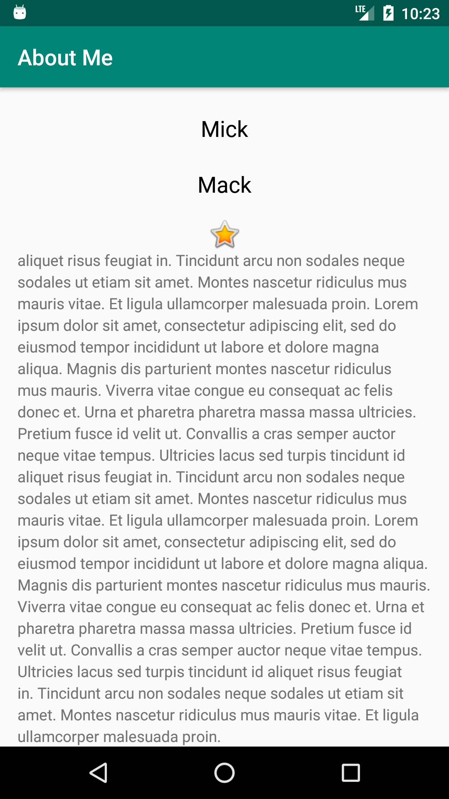
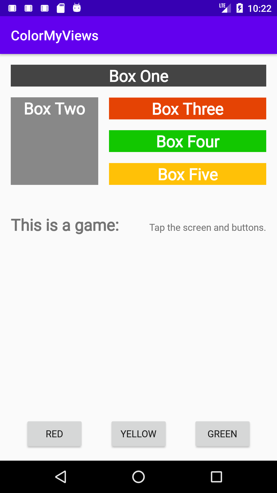
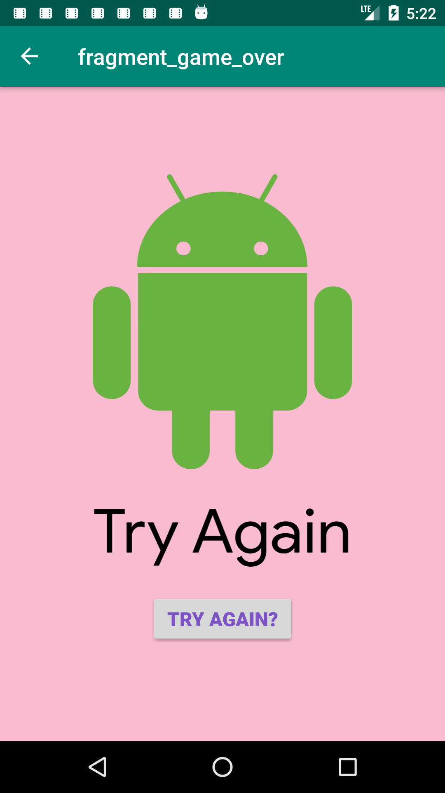
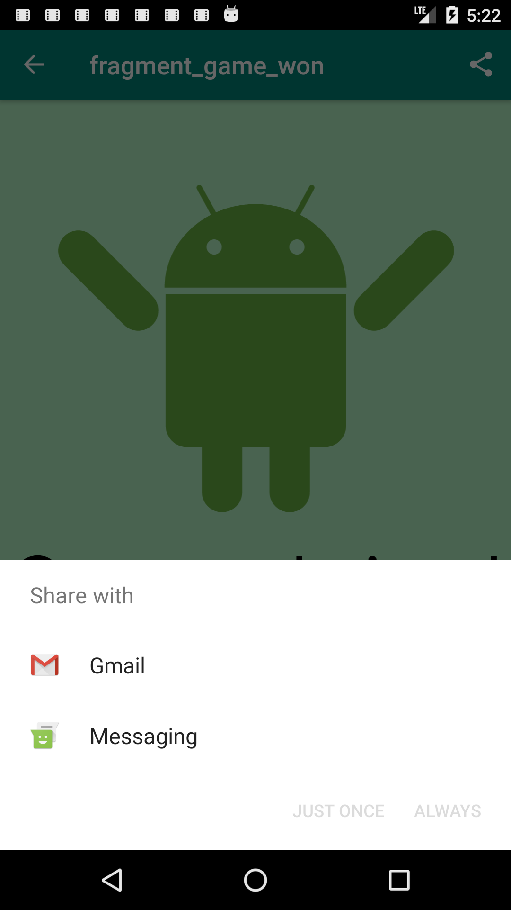
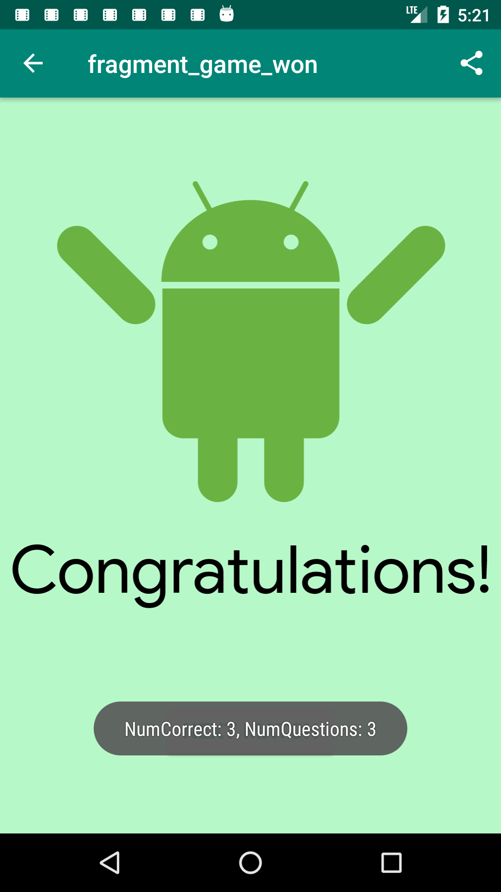

# Developing Android Apps with Kotlin (Udacity)

## Lesson Projects:

Name | Description
--- | ---
DiceRoller | first project to get acquanted using Kotlin. Demonstrates clicking a button to update the image (findViewById)

AboutMe | Demonstrates layouts, databinding, mentions viewbinding may be better depending on use cases

ColorMyView | Demonstrates more about layouts - specifically constraint layouts and onClickListener

AndroidTrivia | Covers fragments, navigation, animation transitions, intents, bundles
 | 
 | 

If you have any questions or feedback, please feel free to msg me. Thanks!
